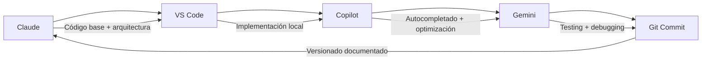
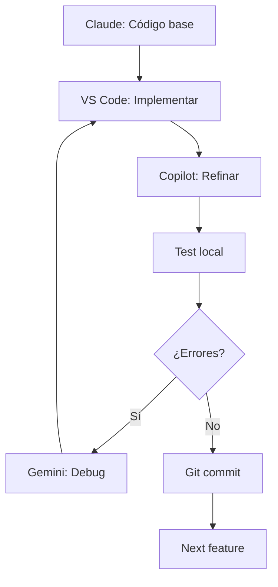

# 🤖 AI Agents - Prompts Guide

## 🎯 **Guía Completa para GitHub Copilot & Gemini Coder Assistant**

Esta guía contiene templates de prompts optimizados para desarrollo eficiente con AI agents en el proyecto **Pasión Frutos Secos**.

---

## 🔄 **Workflow AI-Assisted Development**

### **📊 Roles de cada AI Agent:**



### **🎯 Responsabilidades:**

| AI Agent | Función Principal | Uso |
|----------|------------------|-----|
| **Claude** | Arquitectura + desarrollo base | Código complejo, nuevas features |
| **Copilot** | Autocompletado inteligente | Refinamiento, optimizaciones |
| **Gemini** | Testing + debugging profundo | Validación, corrección errores |

---

## 🚀 **GitHub Copilot - Prompts Específicos**

### **🔧 Para Autocompletado Liquid:**

```liquid
<!-- Escribir comentario descriptivo activa Copilot -->
<!-- Create responsive grid with 3 columns desktop, 1 mobile -->
<div class="categories-grid">
  <!-- Copilot autocompleta estructura -->
</div>

<!-- Generate admin schema for color picker -->
{
  "type": "color",
  "id": "primary_color",
  "label": "Color primario",
  "default": "#8b4513"
}
```

### **🎨 Para CSS Responsive:**

```css
/* Mobile-first responsive grid for product cards */
.product-grid {
  /* Copilot sugiere grid responsive completo */
}

/* Hover effects with smooth transitions */
.card:hover {
  /* Copilot autocompleta animaciones */
}
```

### **⚡ Para JavaScript/Liquid Integration:**

```javascript
// Initialize sticky navigation with scroll detection
document.addEventListener('DOMContentLoaded', function() {
  // Copilot sugiere código completo
});
```

### **📱 Prompts Copilot Chat:**

```
@workspace Fix liquid syntax in sections/hero-integrated.liquid

@workspace Make this CSS responsive following mobile-first approach

@workspace Add accessibility improvements to category cards

@workspace Optimize this code for Shopify performance

@workspace Generate schema settings for admin controls
```

---

## 🔮 **Gemini Coder Assistant - Prompts Agénticos**

### **🛠️ Template Principal - Shopify Expert Mode:**

```markdown
Act as a senior Shopify development expert with 10+ years experience. 

CONTEXT:
- Project: Premium nuts e-commerce store "Pasión Frutos Secos"
- Theme: Dawn customization with custom sections
- Tech stack: Shopify Liquid + VS Code + Shopify CLI
- Code quality: Enterprise level, WCAG compliant

TASK: [Especificar tarea específica]

REQUIREMENTS:
- Follow Shopify 2.0 best practices
- Maintain existing functionality 
- Ensure mobile-first responsive design
- Preserve custom styling and branding
- Optimize for Core Web Vitals

CODE:
[Pegar código específico]

Please provide detailed analysis and solutions.
```

### **🐛 Debugging Template:**

```markdown
SHOPIFY DEBUGGING REQUEST

PROBLEM:
[Describir problema específico]

ERROR DETAILS:
- Browser: [Chrome/Safari/Firefox]
- Device: [Desktop/Mobile/Tablet]  
- Error message: [Mensaje exacto]
- Expected behavior: [Lo que debería pasar]
- Actual behavior: [Lo que está pasando]

CONTEXT:
- File: sections/[filename].liquid
- Theme: Dawn customization
- Shopify CLI version: [version]

CODE CONTEXT:
[Pegar código relevante - líneas específicas donde ocurre el error]

CONSTRAINTS:
- Cannot break existing functionality
- Must maintain responsive design
- Should preserve admin controls
- Must be compatible with Shopify 2.0

Please provide step-by-step debugging analysis and solution.
```

### **✨ New Feature Template:**

```markdown
SHOPIFY FEATURE DEVELOPMENT

FEATURE REQUEST:
[Descripción detallada de la funcionalidad]

SPECIFICATIONS:
- Section: [nombre de sección]
- Admin controls needed: [lista específica]
- Responsive behavior: [desktop/tablet/mobile specs]
- Performance requirements: [loading time, animations]
- Accessibility needs: [WCAG compliance level]

CURRENT STATE:
[Código base existente]

DESIGN REQUIREMENTS:
- Style: Premium, clean, Mediterranean
- Colors: #8b4513 (primary), #2c3e37 (text), #5a6c57 (secondary)
- Animations: Smooth, professional, 0.3s duration
- Grid: Mobile-first responsive

BUSINESS LOGIC:
[Reglas de negocio específicas]

Please develop complete implementation with:
1. Liquid template code
2. CSS styling (responsive)
3. JavaScript (if needed)
4. Admin schema configuration
5. Testing recommendations
```

### **⚡ Performance Optimization Template:**

```markdown
SHOPIFY PERFORMANCE OPTIMIZATION

TARGET: [archivo/sección específica]

CURRENT ISSUES:
- [Lista problemas de rendimiento identificados]
- Page speed: [current score]
- Core Web Vitals: [LCP, FID, CLS scores]
- Mobile performance: [issues específicos]

GOALS:
- Improve loading speed by X%
- Reduce DOM complexity
- Optimize animations and transitions
- Implement lazy loading
- Minimize render blocking

CONSTRAINTS:
- Maintain visual design exactly
- Keep all functionality intact
- Preserve admin configurability
- Ensure Shopify 2.0 compatibility
- No external dependencies

CURRENT CODE:
[Pegar código a optimizar]

Please provide optimized version with:
1. Performance improvements explanation
2. Before/after comparison
3. Testing methodology
4. Expected performance gains
```

### **🎨 Code Review Template:**

```markdown
SHOPIFY CODE REVIEW REQUEST

SECTION: [nombre de sección]
PURPOSE: [para qué sirve la sección]

REVIEW FOCUS:
- [ ] Liquid syntax correctness
- [ ] Schema validation
- [ ] Responsive design quality
- [ ] Accessibility compliance (WCAG 2.1 AA)
- [ ] Performance optimization
- [ ] Code maintainability
- [ ] Shopify best practices
- [ ] Security considerations

CODE TO REVIEW:
[Pegar código completo]

Please provide comprehensive review with:
1. Issues found (critical, high, medium, low)
2. Specific recommendations for each issue
3. Code examples for improvements
4. Best practices implementation
5. Testing suggestions
6. Overall quality assessment (1-10)
```

---

## 🎯 **Prompts por Situación Específica**

### **🔧 Bug Fixing Workflow:**

#### **Paso 1 - Copilot (Quick Fix):**
```
Fix this Shopify Liquid syntax error:
[pegar error específico del terminal]

Context: Custom section for premium nuts e-commerce
Theme: Dawn customization
```

#### **Paso 2 - Gemini (Deep Analysis):**
```markdown
CRITICAL BUG ANALYSIS

ERROR: [error exacto]
FILE: sections/[filename].liquid
IMPACT: [descripción del impacto]

REPRODUCE STEPS:
1. [paso 1]
2. [paso 2] 
3. [resultado]

CONTEXT:
- Environment: Local development with Shopify CLI
- Browser: [específico]
- Device: [específico]

CODE AROUND ERROR:
[líneas relevantes del código]

Please provide:
1. Root cause analysis
2. Step-by-step fix
3. Prevention strategies
4. Testing plan
```

### **📱 Responsive Issues:**

#### **Copilot:**
```
Make this section mobile-first responsive:
- 3 columns desktop → 2 tablet → 1 mobile
- Maintain hover effects on desktop only
- Touch-friendly interactions on mobile
```

#### **Gemini:**
```markdown
RESPONSIVE DESIGN AUDIT

SECTION: [nombre]
CURRENT BREAKPOINTS: [listar]
ISSUES FOUND: [específicos]

REQUIREMENTS:
- Mobile-first approach
- Smooth transitions between breakpoints
- Touch-friendly interactions
- Maintain visual hierarchy
- Optimize for Core Web Vitals

CURRENT CODE:
[pegar CSS + HTML relevante]

Please provide responsive optimization with modern CSS best practices.
```

### **🎨 Design Implementation:**

#### **Copilot:**
```
Create glassmorphism hover effect for product cards:
- Backdrop blur
- Smooth transitions
- Premium feel
- Accessible
```

#### **Gemini:**
```markdown
DESIGN SYSTEM IMPLEMENTATION

STYLE: Premium glassmorphism for e-commerce
BRAND: Mediterranean, natural, trustworthy
COLORS: #8b4513, #2c3e37, #5a6c57

COMPONENT: Product cards with hover effects
INTERACTIONS: Smooth, professional, 300ms duration
ACCESSIBILITY: WCAG 2.1 AA compliant

REFERENCE:
[descripción específica del diseño deseado]

Please implement complete component with CSS and HTML.
```

---

## 📋 **Quick Reference Commands**

### **⚡ Copilot Shortcuts en VS Code:**

| Acción | Comando | Descripción |
|--------|---------|-------------|
| Accept suggestion | `Tab` | Acepta sugerencia completa |
| Partial accept | `Ctrl+→` | Acepta palabra por palabra |
| Next suggestion | `Alt+]` | Siguiente sugerencia |
| Previous suggestion | `Alt+[` | Sugerencia anterior |
| Trigger suggestion | `Ctrl+Enter` | Fuerza sugerencia |
| Open Copilot Chat | `Ctrl+Shift+I` | Abre chat interactivo |

### **🎯 Gemini Quick Prompts:**

```markdown
# Debug rápido
"Debug this Shopify Liquid code: [código]"

# Optimización rápida  
"Optimize this for performance: [código]"

# Accesibilidad rápida
"Add accessibility improvements: [código]"

# Responsive rápido
"Make this mobile-first responsive: [código]"
```

---

## 🔄 **Workflow Iterativo de Desarrollo**

### **🎯 Proceso paso a paso:**



### **📋 Checklist por Feature:**

```markdown
□ Claude desarrolla código base
□ Implementar en VS Code local  
□ Copilot optimiza y refina
□ Testing manual en browser
□ Si hay errores → Gemini debug
□ Testing responsive (mobile/desktop)
□ Validación accessibility
□ Performance check
□ Git commit con mensaje semántico
□ Documentar en DEVELOPMENT_LOG.md
```

---

## 🚨 **Troubleshooting AI Agents**

### **❌ Problemas Comunes:**

| Problema | Solución |
|----------|----------|
| Copilot no sugiere | Verificar auth GitHub + reiniciar VS Code |
| Sugerencias irrelevantes | Escribir comentarios más específicos |
| Gemini respuestas genéricas | Usar templates específicos con contexto |
| Performance lenta | Reducir tamaño de prompt, usar contexto mínimo |

### **✅ Best Practices:**

1. **Contexto específico:** Siempre incluir tecnologías exactas
2. **Errores completos:** Copiar error completo, no solo parte
3. **Código mínimo:** Solo las líneas relevantes al problema
4. **Objetivos claros:** Especificar qué resultado se espera
5. **Constraints claros:** Qué NO debe cambiar

---

## 📊 **Métricas de Éxito**

### **🎯 KPIs Desarrollo con AI:**

- **Velocidad desarrollo:** 5x faster con AI assistance
- **Calidad código:** Theme Check score 95%+
- **Bugs encontrados:** < 2 por feature
- **Time to debug:** < 15 minutos promedio
- **Code consistency:** 100% siguiendo standards

### **📈 Tracking:**

```markdown
Feature: [nombre]
- Tiempo Claude: [X horas]
- Tiempo implementación: [X minutos]  
- Tiempo Copilot refinement: [X minutos]
- Tiempo Gemini testing: [X minutos]
- Total: [X tiempo total]
- Bugs encontrados: [número]
- Performance score: [número]
```

---

## 🔗 **Referencias y Enlaces**

### **📚 Documentación:**
- [GitHub Copilot Docs](https://docs.github.com/copilot)
- [Gemini Code Assist](https://cloud.google.com/products/ai)
- [Shopify Liquid Reference](https://shopify.dev/docs/api/liquid)
- [VS Code Shopify Extensions](https://marketplace.visualstudio.com/shopify)

### **🎯 Prompts Avanzados:**
- [Copilot Best Practices](https://github.blog/developer-skills/programming-languages-and-frameworks/how-to-write-better-prompts-for-github-copilot/)
- [AI Prompt Engineering](https://platform.openai.com/docs/guides/prompt-engineering)

---

## 💡 **Pro Tips**

### **🚀 Maximizar Eficiencia:**

1. **Prepara contexto:** Antes de pedirle a AI, ten claro qué necesitas
2. **Itera rápido:** Pequeños cambios → test → refinar
3. **Combina agents:** Copilot para speed, Gemini para quality
4. **Documenta decisiones:** Por qué se eligió X solución
5. **Aprende patrones:** Los AI aprenden de tu código style

### **🎯 Calidad del Código:**

```liquid
<!-- GOOD: Contexto claro para AI -->
<!-- Create responsive product card with hover effects -->
<!-- Mobile: 1 column, Desktop: 3 columns -->
<!-- Include: image, title, price, CTA button -->
<div class="product-card">
  <!-- AI sugiere estructura completa -->
</div>

<!-- BAD: Sin contexto -->
<div class="card">
  <!-- AI no sabe qué sugerir -->
</div>
```

---

**🎯 Workflow optimizado cuando:**
- ✅ Copilot sugiere código Liquid relevante automáticamente
- ✅ Gemini resuelve bugs en < 15 minutos
- ✅ Development speed aumenta 5x vs manual coding
- ✅ Code quality mantiene standards enterprise
- ✅ Zero breaking changes en production

---

*Guía creada: 2025-08-03*  
*Para uso en: Pasión Frutos Secos AI-assisted development*  
*Workflow: Claude + Copilot + Gemini collaborative coding*